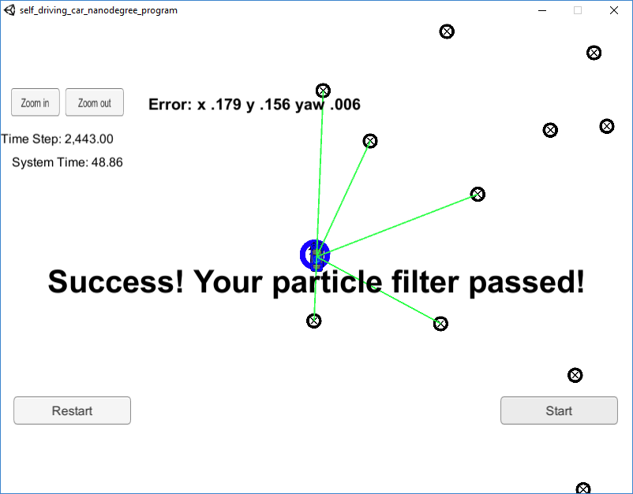
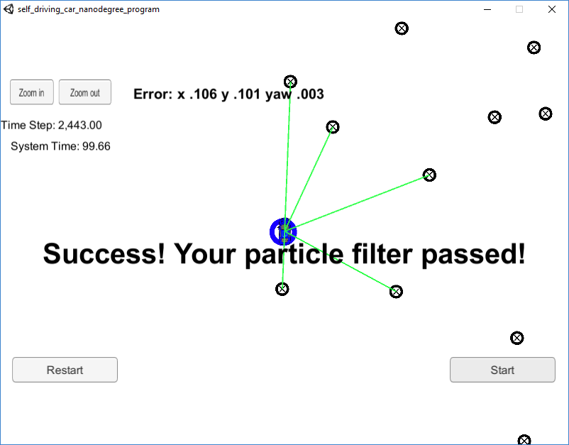

# Overview
This repository contains my implementation of the final project for the Localization course in Udacity's Self-Driving Car Nanodegree.

#### Submission
This submission main difference from the provided basecode is on `particle_filter.cpp` (and its small header file adjustements), which is located in the `src` directory.

## Project Introduction
Your robot has been kidnapped and transported to a new location! Luckily it has a map of this location, a (noisy) GPS estimate of its initial location, and lots of (noisy) sensor and control data.

In this project I implemented a 2 dimensional particle filter in C++. The particle filter can access a map and some initial localization information (analogous to what a GPS would provide). At each time step the filter receives observation and control data. 

## Running the Code
This project involves the Term 2 Simulator which can be downloaded [here](https://github.com/udacity/self-driving-car-sim/releases)

The main program can be built and ran by doing the following from the project top directory.

1. mkdir build
2. cd build
3. cmake ..
4. make
5. ./particle_filter

As said above, the programs that have been updated to accomplish the project are src/particle_filter.cpp, and particle_filter.h

Here is the main protcol that main.cpp uses for uWebSocketIO in communicating with the simulator.

INPUT: values provided by the simulator to the c++ program

// sense noisy position data from the simulator

["sense_x"] 

["sense_y"] 

["sense_theta"] 

// get the previous velocity and yaw rate to predict the particle's transitioned state

["previous_velocity"]

["previous_yawrate"]

// receive noisy observation data from the simulator, in a respective list of x/y values

["sense_observations_x"] 

["sense_observations_y"] 


OUTPUT: values provided by the c++ program to the simulator

// best particle values used for calculating the error evaluation

["best_particle_x"]

["best_particle_y"]

["best_particle_theta"] 

//Optional message data used for debugging particle's sensing and associations

// for respective (x,y) sensed positions ID label 

["best_particle_associations"]

// for respective (x,y) sensed positions

["best_particle_sense_x"] <= list of sensed x positions

["best_particle_sense_y"] <= list of sensed y positions


In order to accomplish the project the methods in `particle_filter.cpp` have to feed the simulator until its output says:

```
Success! Your particle filter passed!
```

## Inputs to the Particle Filter
You can find the inputs to the particle filter in the `data` directory. 

#### The Map*
`map_data.txt` includes the position of landmarks (in meters) on an arbitrary Cartesian coordinate system. Each row has three columns
1. x position
2. y position
3. landmark id

### All other data the simulator provides, such as observations and controls.

> * Map data provided by 3D Mapping Solutions GmbH.

## Success Criteria
If the particle filter passes the current grading code in the simulator, then you should pass! 

The things the grading code is looking for are:

1. **Accuracy**: the particle filter must localize vehicle position and yaw to within the specified values.

2. **Performance**: the particle filter must complete execution within the time of 100 seconds.


## Results

After achieving a working code I looked for limits that would allow to pass the submission. Naturally, more particles means more precision but it comes with a price that is more runtime. On the other side, less particles means less runtime, but with less precision.
I finally found that the minimum number of particles for my code would be 9 (less than that and the errors will fall outside the acceptable range):

and the higest number would be 400 (more than that and the runtime will exceed the 100 seconds limit):

Based on the previous results, 100 particles seems to be a quites reasonable compromise since it is only few seconds slower that the 9 particles version, and achieves a precision very close to the 400 particles version:


Troubles found and their solution to complete the project:
Although each steps of this project are quite simple to understand, melting them all together in the code is a bit confusing and some minor mistakes with big negative effects are quite easy to be made. So, the main point here is to pay attention to details.

Once again, valuable information that helps getting the project working were found on the forum. So, here goes a big thank you for all the people that participate on all those discussions.


